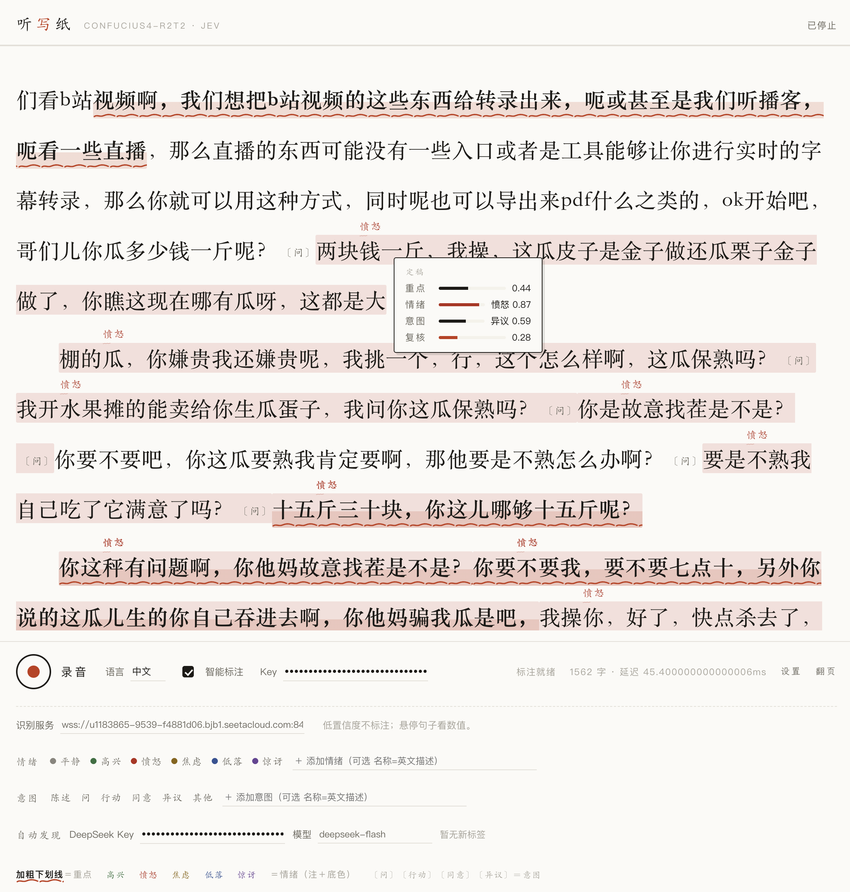

# 听写纸 · 语义标注实时字幕

> 边说边出稿——流式语音识别 + 实时语义批注：重点自动加粗画线、情绪上色、意图盖章，标签体系还能自我生长。

基于 [Confucius4-R2T2](https://github.com/netease-youdao/Confucius4-R2T2)（网易有道开源的流式 ASR 模型）做听写，[TypeSafe Jev](https://docs.typesafe.ai/) 做逐句实时判断，可选接入 DeepSeek 自动发现新标签。适用于**会议、访谈、播客、直播、口播视频**等任何"说话→要文字稿"的场景。

## 效果展示

| 封面 | 实际使用 |
|:---:|:---:|
|  |  |

> 实拍：流式字幕逐句上屏，重点句自动加粗＋朱砂波浪线，情绪以楷体小注＋整句底色标注，意图盖〔〕章；录音时页眉下有实时音波条，悬停任意句子可查看重点/情绪/意图/复核四项数值。

## 核心特性

- **追加式流式字幕**：识别延迟 100ms 级，已上屏的文字永不回改，逐句落定
- **两级实时标注**：话说到一半就先标（live 级），句子闭合立即终判覆盖（final 级），标注几乎与文字同步出现
- **三个标注维度**，视觉互不冲突、可叠加：
  - 重点 → 加粗 + 手绘波浪下划线（朱砂色）+ 马克笔底色
  - 情绪 → 句子上方楷体浮注（如"愤怒/焦虑/高兴"）+ 整句对应色底染
  - 意图 → 句尾印章〔问〕〔行动〕〔同意〕〔异议〕
- **意图四道门**（宁缺勿错）：choice 命中 + 置信度 ≥0.55 + 领先幅度 ≥0.12 + Noul 复核（异议等高误伤类目复核线 0.70）
- **标签体系完全自定义**：情绪/意图可增删改（含默认项）、情绪颜色取色器自定义、每项可配英文判定描述，改动下一句即生效
- **标签自动生长**（可选）：DeepSeek 低频旁听转写，发现现有标签覆盖不了的反复出现的情绪/意图，弹卡提议，一键采纳
- **悬浮数值卡**：悬停任意句子，即时显示重点/情绪/意图/复核四项数值与置信度条
- **零构建前端**：单个 HTML 文件，无框架、无依赖、无打包，任意静态服务即可跑
- API Key 只存浏览器 localStorage，经同源代理透传，服务端不落盘

## 架构

```
┌─────────── 浏览器（web/index.html）───────────┐
│ 麦克风 → AudioWorklet(16k/160ms int16) → WS──┼──→ ① ASR 服务 ws_server (6006)
│ 字幕渲染 + 颜色标注 + 音波可视化               │      Confucius4-R2T2 (vLLM)
│            ↑ 增量文本                          │      追加式流式识别
│            ↓ 每句分析请求                       │
│ fetch POST /typesafe /deepseek ───────────────┼──→ ② server/server.py (6008)
└───────────────────────────────────────────────┘      静态页 + 同源 API 代理
                                                       ├→ api.typesafe.ai   (Jev)
                                                       └→ api.deepseek.com  (可选)
```

ASR 输出是追加式的（已出文字不回改），所以"句"一旦闭合就固定不变——标注可以安全地写死在句子上，这是两级标注架构成立的前提。

## 依赖清单

### ① ASR 服务端（需要 GPU）

| 依赖 | 要求 |
|---|---|
| GPU | NVIDIA ≥16GB 显存（RTX 4090 24G 实测；vLLM 后端） |
| 驱动 | ≥ 525（配合 CUDA 12.8 轮子；实测 580） |
| 系统 | Linux（Ubuntu 22.04 实测） |
| Python | 3.10+，3.12 实测（conda 环境隔离） |
| Confucius4-R2T2 | 上游仓库 `pip install -e .`，会装 qwen-asr[vllm] → vllm 0.14.0 + torch 2.9.1+cu128 |
| ASR 权重 | [ModelScope](https://modelscope.cn/models/netease-youdao/Confucius4-R2T2) 或 [HuggingFace](https://huggingface.co/netease-youdao/Confucius4-R2T2)，约 4GB |
| VAD 权重 | [FireRedTeam/FireRedVAD](https://huggingface.co/FireRedTeam/FireRedVAD) 的 `Stream-VAD/` 子目录（2MB），放 `checkpoints/vad/Stream-VAD` |
| 磁盘 | 权重 4GB + conda 环境约 15GB |

### ② 伴随服务（server/server.py）

- 仅 Python 3.8+ **标准库**（http.server / urllib），无第三方依赖

### ③ 浏览器（web/index.html）

- Chrome / Edge / Safari 现代版本（AudioWorklet + getUserMedia）
- 麦克风权限要求**安全上下文**：HTTPS 或 localhost

### ④ API Key（按需）

| Key | 用途 | 获取 |
|---|---|---|
| TypeSafe API Key | Jev 逐句标注（重点/情绪/意图）——核心功能必需 | [console.typesafe.ai/keys](https://console.typesafe.ai/keys) |
| DeepSeek API Key | 标签自动发现——可选 | [platform.deepseek.com](https://platform.deepseek.com) |

## 快速开始

### 第一步：部署 ASR 服务（GPU 服务器上）

```bash
# 1. 上游仓库与环境
git clone https://github.com/netease-youdao/Confucius4-R2T2.git
cd Confucius4-R2T2
conda create -n confucius4-r2t2 python=3.12 -y && conda activate confucius4-r2t2
pip install -e .   # 国内建议: -i https://mirrors.cloud.tencent.com/pypi/simple

# 2. 下载权重（国内走 ModelScope）
pip install -U modelscope
modelscope download --model netease-youdao/Confucius4-R2T2 \
  --local_dir checkpoints/Confucius4-R2T2

# 3. VAD 模型（WS 服务需要）
export HF_ENDPOINT=https://hf-mirror.com
pip install -U "huggingface_hub[cli]"
mkdir -p checkpoints/vad && cd checkpoints/vad
hf download FireRedTeam/FireRedVAD --include "Stream-VAD/*" --local-dir .

# 4. 启动（模型加载约 1~2 分钟，见 nohup_service_ws_*.log 里 Worker ready）
export HF_HUB_OFFLINE=1   # 国内直连 huggingface.co 不通时必加
./run_start_server.sh start --model_path $PWD/checkpoints/Confucius4-R2T2 --port 6006 --gpu 0
```

### 第二步：启动本项目

```bash
git clone https://github.com/limboinf/semantic-live-caption.git
cd semantic-live-caption
python server/server.py --port 6008        # 或 scripts/start_all.sh 一键拉起两个服务
```

### 第三步：打开页面配置

1. 浏览器打开 `http://<服务器>:6008/`（公网访问需 HTTPS，见下方端口映射）
2. 「设置」里确认识别服务地址（默认 `ws://127.0.0.1:6006/asr_stream_api_v1`，远程改成你的公网 WS 地址）
3. 填入 TypeSafe API Key，勾选「智能标注」；可选填 DeepSeek Key 启用标签自动发现
4. 点录音键，开说

### 公网访问（AutoDL / SeetaCloud 示例）

平台端口映射到 HTTPS 公网地址后，把映射到 6006 的 `wss://…/asr_stream_api_v1` 填进页面「设置」即可；平台代理需支持 WebSocket（AutoDL/SeetaCloud 实测支持）。自建服务器可用 nginx/caddy 做 TLS + WS 反代，效果相同。

## 工作原理（简）

- **WS 协议**：首帧 JSON 元信息（采样率/语言/`mode:"slow"` 等）→ 每 160ms 一帧 int16 PCM 二进制 → 收 `{"status":"success","msg":{"text":增量文本}}`；结束发 `YOUDAO_ONETIME_ASR_STREAM_EOS`
- **两级标注**：live 级分析"正在说的半句"（350ms 防抖 + 700ms 限频，带换代计数防竞态）；句子闭合立即 final 级终判并覆盖；两级并发上限各 2
- **Jev 单次调用 fan-out**：`is_key`(noul) + `emotion`(choice) + `intent`(choice) + 每个可见意图一条投机性 Noul 复核，全部并行、零额外时延
- **标签发现**：每 90s（或停止时）把最近 40 句交给 DeepSeek，"同类表达 ≥3 次才提名、每类 ≤2 个"，右下角建议卡〔采纳/忽略〕，忽略项持久化不再提

## 可调参数（web/index.html 顶部常量）

| 常量 | 默认 | 说明 |
|---|---|---|
| `TH_KEY` | 0.60 | 重点判定线（noul 值） |
| `TH_CONF` | 0.50 | 情绪置信度门槛 |
| `INTENT_CONF_TH` / `INTENT_MARGIN_TH` | 0.55 / 0.12 | 意图置信度 / 领先幅度门 |
| `INTENT_NOUL_TH` / `INTENT_STRICT_TH` | 0.55 / 0.70 | 意图复核线 / 严格类目（如"异议"）复核线 |
| `LIVE_DEBOUNCE` / `LIVE_MIN_GAP` | 350 / 700 ms | 实时级触发节流 |
| `FORCE_SPLIT` / `SEG_EVERY` | 40 字 / 6 句 | 无标点强切 / 换段密度 |

## 常见问题

- **重启后服务没了？** 两个服务都是 nohup 前台转后台，不随开机自启；重跑 `scripts/start_all.sh`。
- **中文标注不准？** Jev 对 CJK 的校准弱于英语，低置信结果会自动不标；可在「设置→编辑标签」里为每个标签补英文描述（判定标准），提升明显。
- **pip 装 vllm 卡住？** 换腾讯源并带 `--timeout 60 --retries 8`；断流会自动恢复。
- **浏览器拿不到麦克风？** 页面必须是 HTTPS 或 localhost；检查系统隐私设置里的麦克风权限。

## 致谢

- [netease-youdao/Confucius4-R2T2](https://github.com/netease-youdao/Confucius4-R2T2) — 流式 ASR 模型与服务（Apache-2.0 代码；模型权重遵循 NetEase Model Use License）
- [TypeSafe](https://docs.typesafe.ai/) — Jev 结构化判断模型
- [DeepSeek](https://www.deepseek.com/) — 标签发现

## 许可

本仓库代码以 [MIT License](LICENSE) 开源。

模型权重与上游服务各自遵循其原始许可；商用前请阅读 [NetEase Model Use License](https://github.com/netease-youdao/Confucius4-R2T2/blob/main/MODEL_LICENSE) 与 TypeSafe / DeepSeek 的服务条款。ASR WebSocket 服务默认携带上游调试用 `secret_key`（见上游仓库），公开部署时请自行修改。
